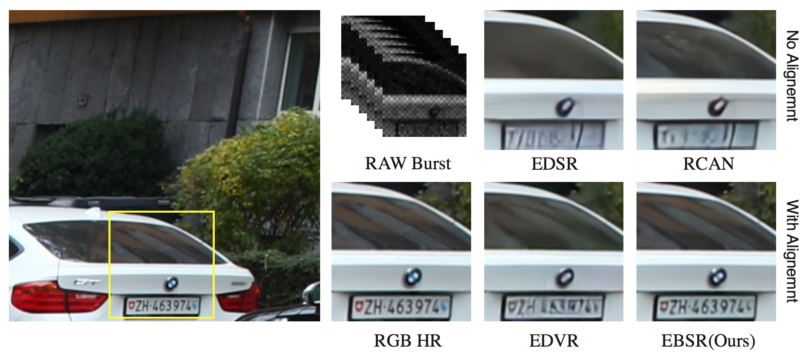

# EBSR: Feature Enhanced Burst Super-Resolution With Deformable Alignment (CVPRW 2021)


### Update !!!
- **2022.01.22** We updated the code to support real track testing and provided the model weights [here](https://drive.google.com/file/d/1Zz21YwNtiKZCjerrZsdvcWyubqTJBwaD/view?usp=sharing)
- **2021** Now we support 1 GPU training and provide the pretrained model [here](https://drive.google.com/file/d/1_WA2chhITIsCj6qImcEM2lD6c-iJsRpy/view?usp=sharing).


<!---->
<div  align="center"> 

</div>

This repository is an official PyTorch implementation of the paper **"EBSR: Feature Enhanced Burst Super-Resolution With Deformable Alignment"** from CVPRW 2021, 1st NTIRE21 Burst SR in real track (2nd in synthetic track).

## Dependencies
- OS: Ubuntu 18.04
- Python: Python 3.7
- nvidia :
   - cuda: 10.1
   - cudnn: 7.6.1
- Other reference requirements

## Quick Start
1.Create a conda virtual environment and activate it
```python3
conda create -n pytorch_1.6 python=3.7
source activate pytorch_1.6
```
2.Install PyTorch and torchvision following the official instructions
```python3
conda install pytorch==1.6.0 torchvision==0.7.0 cudatoolkit=10.1 -c pytorch
```
3.Install build requirements
```python3
pip3 install -r requirements.txt
```
4.Install apex to use DistributedDataParallel following the [Nvidia apex](https://github.com/NVIDIA/apex)
```python3
git clone https://github.com/NVIDIA/apex
cd apex
pip install -v --disable-pip-version-check --no-cache-dir --global-option="--cpp_ext" --global-option="--cuda_ext" ./
```
5.Install DCN
```python3
cd DCNv2-pytorch_1.6
python3 setup.py build develop # build
python3 test.py # run examples and check
```
## Training
```python3
# Modify the root path of training dataset and model etc.
# The number of GPUs should be more than 1
python main.py --n_GPUs 4 --lr 0.0002 --decay 200-400 --save ebsr --model EBSR --fp16 --lrcn --non_local --n_feats 128 --n_resblocks 8 --n_resgroups 5 --batch_size 16 --burst_size 14 --patch_size 256 --scale 4 --loss 1*L1
```
## Test
```python3
# Modify the path of test dataset and the path of the trained model
python test.py --root /data/dataset/ntire21/burstsr/synthetic/syn_burst_val --model EBSR --lrcn --non_local --n_feats 128 --n_resblocks 8 --n_resgroups 5 --burst_size 14 --scale 4 --pre_train ./checkpoints/EBSRbest_epoch.pth
```
or test on the validation dataset:
```python3
python main.py --n_GPUs 1 --test_only --model EBSR --lrcn --non_local --n_feats 128 --n_resblocks 8 --n_resgroups 5 --burst_size 14 --scale 4 --pre_train ./checkpoints/EBSRbest_epoch.pth
```
### Real track evaluation
You may need to download pretrained PWC model to the pwcnet directory ([here](https://drive.google.com/file/d/1dD6vB9QN3qwmOBi3AGKzJbbSojwDDlgV/view?usp=sharing)).

```
python test_real.py --n_GPUs 1 --model EBSR --lrcn --non_local --n_feats 128 --n_resblocks 8 --n_resgroups 5 --burst_size 14 --scale 4 --pre_train ./checkpoints/BBSR_realbest_epoch.pth --root burstsr_validation_dataset...

```

## Citations
If EBSR helps your research or work, please consider citing EBSR.
The following is a BibTeX reference.

```
@InProceedings{Luo_2021_CVPR,
    author    = {Luo, Ziwei and Yu, Lei and Mo, Xuan and Li, Youwei and Jia, Lanpeng and Fan, Haoqiang and Sun, Jian and Liu, Shuaicheng},
    title     = {EBSR: Feature Enhanced Burst Super-Resolution With Deformable Alignment},
    booktitle = {Proceedings of the IEEE/CVF Conference on Computer Vision and Pattern Recognition (CVPR) Workshops},
    month     = {June},
    year      = {2021},
    pages     = {471-478}
}
```

## Contact
email: [ziwei.ro@gmail.com, yl_yjsy@163.com]
